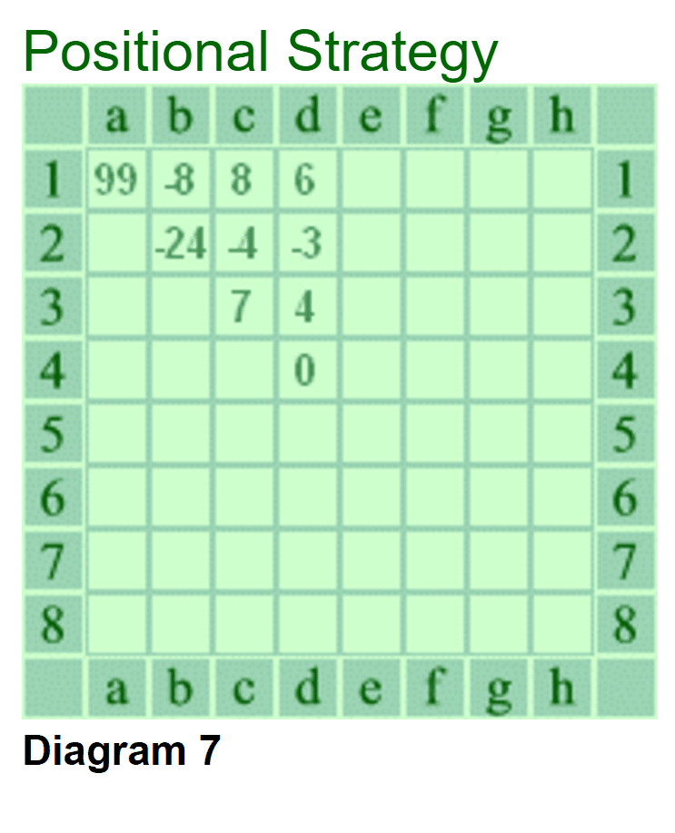

# Mini-Alphago
An AI for Reversi.
### v0.3.1: 采用取确定子的策略。10s 10000次模拟。可击败第三等级的AI。

https://en.wikibooks.org/wiki/Reversi/Strategy
### 参考:
1. 考虑分段策略。
2. reducing the number of moves available to your opponent - An ideal position involves having all your pieces in the center surrounded by your opponent's pieces. In such situations you can dictate what moves your opponent can make.
3. When moves seem equal with respect to what moves you will leave yourself and your opponent, playing a minimum piece strategy will tend to advantage you, because minimizing your discs will tend to leave fewer discs for your opponent to flip in subsequent moves of the game.
4. About edge: While playing pieces to edges of the board may seem sound (because they cannot be flipped easily), this can often prove detrimental.
5. About Square: NO.  when played in the early or middle game, typically guarantees the loss of that corner. 
In general you should avoid edge play in the early and middle game if possible, unless you can gain larger concessions in terms of mobility or a mass of unflippable pieces.
6. Parity: 奇偶性：By simply counting out the number of squares in a region, one can ascertain whether an odd or an even number of squares exist. In the case of an odd number of squares, by playing there first you can force your opponent to play first outside of that region. 
7. EndGame: For the endgame (the last 20 or so moves of the game) the strategies will typically change. Special techniques such as sweeping, gaining access, and the details of move-order can have a large impact on the outcome of the game. At these late stages of the game no hard-set rules exist. The experienced player will try to look ahead and get a feel for what will lead to the best final outcome. 

### v0.4.0: 采用优先级策略。可以击败困难难度，输给超困难难度。后期表现不佳。
